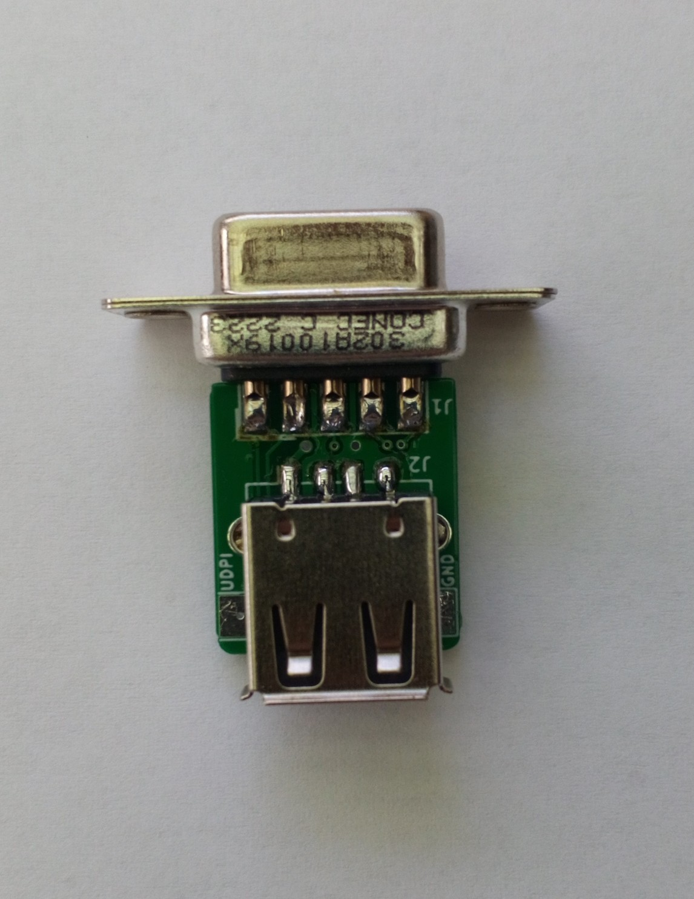
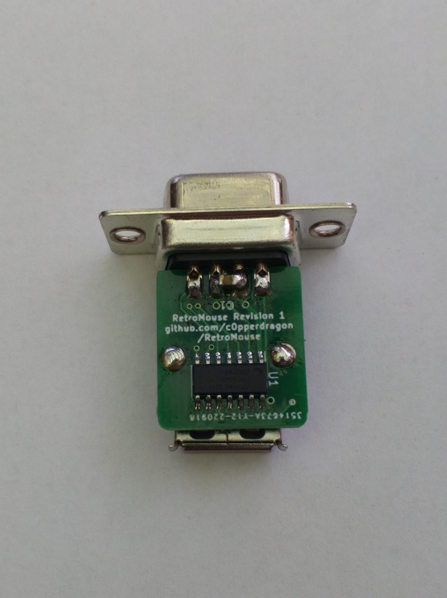

# RetroMouse
Adapter to attach PS/2 compatible mice to retro computers

I wanted to try to make such an adapter using only one attiny1604 microcontroller 
with only the minimum additional circuitry.
This part also was one of the few that mouser actually had in stock.

## Mouse compatibility

USB socket suggests that any USB mouse can be used, but that is actually not true. In 
reality the adapter only supports the PS/2 interface protocol which can be handled by
regular microcontrollers just well.

For this to work, the mouse must be able to optionally support PS/2 if needed. Luckily this
compatibility is present in quite many devices, especially in the cheap and simple variants.
Unluckily on the other hand, this compatibilty depends on the specific controller IC the
manufacturer used for the mouse and can not really be guessed from the outside.
When PS/2 compatibility is not directly advertised, the only thing to do is just try.

## Arduino development

The microcontroller is supported by the Arduino IDE (using the megaTinyCore add-on).
To modify the firmware, you need a programmer device to re-flash the microcontroller
using the UDPI pin. Details on this process are available on the megaTinyCore webpage.

## Compatibility

This adapter works with Amiga and C64 computers and can auto-detect the host machine.
Further machines (for example Atari ST) may be supported in the future. 

## C64 input modes

From power-up, the adapter emulates the Commodore 1351 mouse. If you want to 
emulate a pair of paddles instead (to play Arkanoid, for example) hold down the right mouse button 
and click the left button 5 times. Doing the same thing with 6 left clicks switches back
to standard mode.

